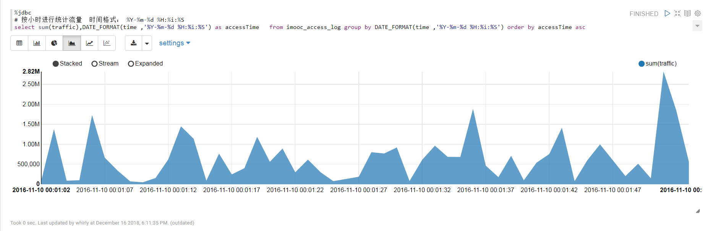
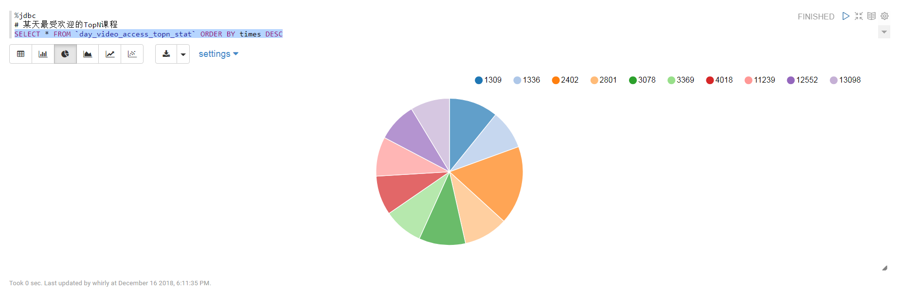
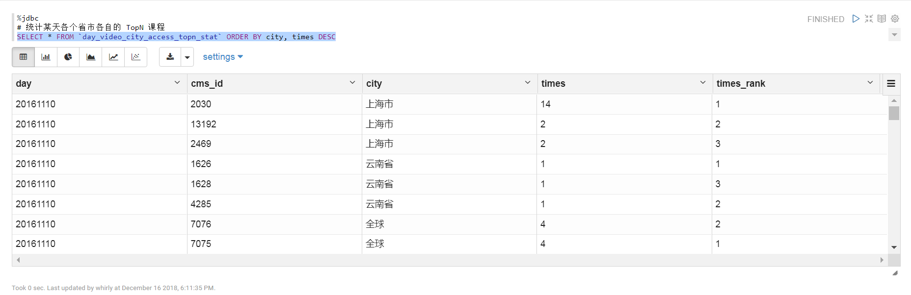

# Spark SQL 分析 Imooc 访问日志

## 前言

### 环境说明

- Java版本：1.8
- Scala版本：2.11.12
- Hadoop版本：hadoop-2.6.0-cdh5.14.0
- spark版本：spark-2.3.1-bin-2.6.0-cdh5.14.0（自己编译）
- MySQL版本：5.7.22
- zeppelin版本：0.8

### 数据集

**Imooc 访问日志文件**：access.20161111.log     

**数据量**：一千多万条访问日志、5G多   

**日志格式**：   

```
60.165.39.1 - - [10/Nov/2016:00:01:53 +0800] "POST /course/ajaxmediauser HTTP/1.1" 200 54 "www.imooc.com" "http://www.imooc.com/code/1431" mid=1431&time=60 "Mozilla/5.0 (Windows NT 6.1; WOW64) AppleWebKit/537.36 (KHTML, like Gecko) Chrome/38.0.2125.122 Safari/537.36 SE 2.X MetaSr 1.0" "-" 10.100.136.64:80 200 0.014 0.014
14.145.74.175 - - [10/Nov/2016:00:01:53 +0800] "POST /course/ajaxmediauser/ HTTP/1.1" 200 54 "www.imooc.com" "http://www.imooc.com/video/678" mid=678&time=60&learn_time=551.5 "Mozilla/5.0 (Windows NT 6.1; WOW64) AppleWebKit/537.36 (KHTML, like Gecko) Chrome/45.0.2454.101 Safari/537.36" "-" 10.100.136.64:80 200 0.014 0.014
```

**百度云盘下载地址**：链接：https://pan.baidu.com/s/1VfOG14mGW4P4kj20nzKx8g 提取码：uwjg    

**开发测试数据**：access.1w.log（10000条）   

### 需求

* 统计某天最受欢迎的TopN课程
* 统计某天各个省市各自的 TopN 课程
* 按照流量进行统计 TopN 课程
* 某天最受欢迎的文章
* 某天进行code最多的课程
* 统计某天最勤奋的 IP
* 欢迎补充......

### 统计结果可视化(zeppelin展示)








## 开发步骤

### 数据清洗

根据需求，从日志中解析出我们需要的信息，譬如可能有：

1. 访问的系统属性： 操作系统、浏览器等等
2. 访问特征：url、referer (从哪个url跳转过来的)、页面上的停留时间等
3. 访问信息：session_id、访问ip(访问城市)等

#### 主程序

- SparkStatFormatJob.scala  第一步，清洗出 ip, time, url, traffic

- SparkStatCleanJob.scala 第二步，最终清洗转换得到  url、cmsType、cmsId、traffic、ip、city、time、day
- AccessConvertUtil.scala 定义DataFrame schema，将日志信息转为对象，帮助RDD转为DataFrame
- DateUtils.scala 时间格式转换

#### 步骤

1. 使用 Spark SQL 解析访问日志
2. 解析出课程编号类型
3. 根据IP解析出城市名称
4. 使用 Spark SQL 将访问时间按天进行分区输出

#### 关键代码

清洗第一步

```scala
accessFile.map(line => {
      val splits = line.split(" ") // 按空格分割
      val ip = splits(0) // 第一个是IP
      // 原始日志的第三个和第四个字段拼接起来就是完整的访问时间： [10/Nov/2016:00:01:02 +0800] ==> yyyy-MM-dd HH:mm:ss
      val time = splits(3) + " " + splits(4)
      val url = splits(11).replaceAll("\"", "") // 第11个是 URL
      val traffic = splits(9) // 第9个是流量
      List(DateUtils.parse(time), url, traffic, ip)
    })
      // 过滤
      .filter(item => !"10.100.0.1".equals(item(3)))
      .filter(item => !"-".equals(item(1)))
      // 拼成一个对象 (DateUtils.parse(time), url, traffic, ip)
      .map(item => item(0) + "\t" + item(1) + "\t" + item(2) + "\t" + item(3))
      // 保存
      .saveAsTextFile(Constants.protocol + Constants.tempOut)
```

清洗第二步

```
val filterRDD = accessRDD.map(line => AccessConvertUtil.parseLog(line))
val accessDF = spark.createDataFrame(filterRDD, AccessConvertUtil.struct)

// 保存到 parquet
accessDF.coalesce(1).write.format("parquet").mode(SaveMode.Overwrite).partitionBy("day").save(Constants.protocol + Constants.cleanedOut)

```

清洗结果样例

```

+--------------------------------------------+-------+-----+-------+---------------+----+-------------------+--------+
|url                                         |cmsType|cmsId|traffic|ip             |city|time               |day     |
+--------------------------------------------+-------+-----+-------+---------------+----+-------------------+--------+
|http://www.imooc.com/code/1852              |code   |1852 |2345   |117.35.88.11   |陕西省 |2016-11-10 00:01:02|20161110|
|http://www.imooc.com/learn/85/?src=360onebox|learn  |85   |14531  |115.34.187.133 |北京市 |2016-11-10 00:01:27|20161110|
|http://www.imooc.com/course/list?c=fetool   |course |0    |66     |120.198.231.151|广东省 |2016-11-10 00:01:27|20161110|
|http://www.imooc.com/code/10047             |code   |10047|54     |101.36.73.155  |北京市 |2016-11-10 00:01:27|20161110|
+--------------------------------------------+-------+-----+-------+---------------+----+-------------------+--------+
```


### Spark SQL 统计 TopN

#### 主程序

- TopNStatJob.scala Spark SQL 统计主类
- StatDao.scala 将各个统计作业的统计结果写到数据库
- MySQLUtils.scala 管理 MySQL JDBC 连接

#### 关键代码

```scala
/**
  * 统计某天各个省市各自的 TopN 课程
  */
def cityAccessTopNStat(spark: SparkSession, accessDF: DataFrame, day: String): Unit = {
  import spark.implicits._
  val cityAccessTopNDF = accessDF.filter($"day" === day && $"cmsType" === "video" && $"cmsId" =!= "0")
    .groupBy("city", "day", "cmsId")
    .agg(count("cmsId").as("times"))

  // Window 函数在Spark SQL的使用: 窗口函数 row_number 的作用是根据表中字段进行分组，然后根据表中的字段排序，
  //  给组中的每条记录添加一个序号；且每组的序号都是从1开始，可利用它的这个特性进行分组取top-n
  val top3DF = cityAccessTopNDF.select(
    cityAccessTopNDF("day"), cityAccessTopNDF("city"),
    cityAccessTopNDF("cmsId"), cityAccessTopNDF("times"),
    row_number().over(Window.partitionBy(cityAccessTopNDF("city")) // 根据 city 分组，根据 times 降序排序
      .orderBy(cityAccessTopNDF("times").desc)).as("times_rank")
  ).filter("times_rank <= 3")

  // 保存到 MySQL，需创建结果表 day_video_city_access_topn_stat
  try {
    top3DF.foreachPartition(partition => {
      val list = new ListBuffer[DayCityVideoAccessStat]

      partition.foreach(item => {
        val day = item.getAs[String]("day")
        val cmsId = item.getAs[Long]("cmsId")
        val city = item.getAs[String]("city")
        val times = item.getAs[Long]("times")
        val timesRank = item.getAs[Int]("times_rank")
        list.append(DayCityVideoAccessStat(day, cmsId, city, times, timesRank))
      })
      StatDao.insertDayCityVideoAccessTopN(list)
    })
  } catch {
    case e: Exception => e.printStackTrace()
  }
}
```

#### 统计结果样例

```
+--------+-------+-----+-----+----------+
|day     |city   |cmsId|times|times_rank|
+--------+-------+-----+-----+----------+
|20161110|北京市    |1309 |20   |1         |
|20161110|北京市    |3369 |16   |2         |
|20161110|北京市    |4018 |15   |3         |
|20161110|辽宁省    |1336 |2    |1         |
|20161110|辽宁省    |9028 |1    |2         |
|20161110|辽宁省    |8141 |1    |3         |
|20161110|浙江省    |3078 |19   |1         |
|20161110|浙江省    |12552|16   |2         |
|20161110|浙江省    |3237 |14   |3         |
+--------+-------+-----+-----+----------+
```


## 项目开发说明

1、 CDH相关的软件下载地址：http://archive.cloudera.com/cdh5/cdh/5/，spark自己编译的，看官方文档即可


2、IDEA需要安装Scala插件


3、 Windows上开发需解压Hadoop和spark源码，然后在环境变量中配置HADOOP_HOME和SPARK_HOME


4、 windows上需下载相应版本的 [winutils.exe ](https://github.com/steveloughran/winutils/tree/master/hadoop-2.6.0/bin) 文件放到 $HADOOP_HOME/bin


5、 解析IP地址使用  [ipdatabase ](https://github.com/wzhe06/ipdatabase) ，三个步骤：

```
1）git clone https://github.com/wzhe06/ipdatabase.git
2）编译下载的项目：mvn clean package -DskipTests
3）安装jar包到自己的maven仓库
mvn install:install-file -Dfile=/home/whirly/source/ipdatabase/target/ipdatabase-1.0-SNAPSHOT.jar -DgroupId=com.ggstar -DartifactId=ipdatabase -Dversion=1.0 -Dpackaging=jar
```


6、 需要创建相应的数据库和数据表，用于存储统计结果，具体的表结构见 imooc_log.sql ，Navicat 导入MySQL即可，创建库表完毕后须修改 MySQLUtils.scala 中的配置信息


7、 zeppelin 可导入 最受欢迎的TopN课程.json 文件查看结果，也可以使用可视化方案，譬如echarts、highcharts、D3.js、HUE等等...

